# Low Reynolds Number  

Low Reynlds numbers are generally indicative of laminar airflow and low airspeeds. Although storm winds do not fall into this category, it is useful to examine the behavior of the airflow at low speeds to guage thegeneral effects of altering physical parameters such as wall thickness and window width. Windows come in a variety of sizes, as do wall thicknesses - so it is important t o understand the effests of altering the aforementioned geometries on the airflow.

Note all values are nondimensionalized - all lengths are in terms of $L$, the cavity length, all speeds in terms of $U$, the initial flow speed, and all times in terms of $\frac{L}{U}$.  

The pressure is in terms of $\frac{p}{\rho U^2}$. All low-Reynolds simulations were run till T=6.  


## General Solution Form  

We will now show the pressure, X-velocity, Y-velocity, and streamlines in sets of 4 by varying geometry along the following pattern. Contours are not shown due to their bias toward out-of-cavity portions and the coarse mesh will be omitted for brevity. Convergence studies will be done numerically afterward.    


Pattern:  

```{r, tidy=FALSE}
data2 <- read.table(stringsAsFactors = FALSE, header = TRUE, sep="/", text =
'window size a / wall thickness w
0.05 / 0.05
0.05 / 0.1
0.50 / 0.05
0.50 / 0.1'
)
knitr::kable((data2), booktabs = TRUE,
caption = '')
```

### Re=10, Pressure

{width=40% height=20%}
{width=40% height=20%}
{width=40% height=20%}
{width=40% height=20%}  

Note that all meshes have relatively even internal pressure, suggesting internal flow speeds are miniscule.
Also, the more contact the cavity has with the crossflow, the lower the internal cavity pressure. This pressure differential works in attempt to equalize flow conditions, but due to the gradient induced by inequal flows, the interior pressure drops. 
Finally, consider the inlet. Note that the higher-pressure regions localize at the corners with larger windows, implying that the cavity acts as a sort of pressure sink.   


### Re=10, X-velocity

{width=40% height=20%}
{width=40% height=20%}
{width=40% height=20%}
{width=40% height=20%}  

Similarly, the flow x-velocity dissipates across the window in amounts positively correlated with larger and thinner windows. This is due to the reduced physical impedence of an impermiable zero-flow velocity structure that is the wall.
No discernible cavity flow can be seen yet.  

### Re=10, Y-velocity

{width=40% height=20%}
{width=40% height=20%}
{width=40% height=20%}
{width=40% height=20%}  

The same story can be seen in the y-velocities, but now there can be seen a cavity circulation (by the mild color differences inside the cavity).
Note that the windows of 0.05 width produce really mild, near-complete cavity circulation, while the larger windows of 0.5 width produce much stronger but incomplete circulation
(the corners are relatively unaffected).  

### Re=10, Streamlines

{width=40% height=20%}
{width=40% height=20%}
{width=40% height=20%}
{width=40% height=20%}  

This is confirmed by the streamline plots. Note that there are between 1-3 transition vortices. At maximum, with the most neck-like window, there is a vortice the window opening, one in the window
another in opening to the cavity. These three vortices connect the crossflow to the internal centralized vortex. When the window is broadened, these vortices all combine to form a single large transition vortice. Finally, note the center of the centralized vortice is very close to the center, and the crossflow bend is similarly symmetric, despite the flow directionality. This symmetry is probably due to the low Reynolds number of the flow.  

### Re=200, Pressure

{width=40% height=20%}
{width=40% height=20%}
{width=40% height=20%}
{width=40% height=20%}  

The pressure for Re=200 is very similar to that of Re=10 - the cavity acts like a simple pressure sink.
  
### Re=200, X-velocity

{width=40% height=20%}
{width=40% height=20%}
{width=40% height=20%}
{width=40% height=20%}  

The only major difference is the asymmetry, which is probably due to the Reynolds number. Note that these solutions are also stable, and have been checked by flow visualization over time.  

### Re=200, Y-velocity

{width=40% height=20%}
{width=40% height=20%}
{width=40% height=20%}
{width=40% height=20%}  
 
Note that in addition to the asymmetry (same as seen in the x-velocity plots), there is an additional hydraulic jump right at the upper-right window corner, as the flow resumes high speed.  
We will return to this in the high Reynolds section, as with increasing Re, this sort of jump can cause additional effects. We can also see the prominent third transition vortice clearly in the top-right plot. 

### Re=200, Streamlines

{width=40% height=20%}
{width=40% height=20%}
{width=40% height=20%}
{width=40% height=20%}  

Note the prominent third transition vortice. Otherwise, everything is as expected from Re=10 flow, except for the asymmetry.

## Vortice Positions  

Convergence can easily be seen by looking at the centralized vortex position for both meshes, by differing geometry.

```{r, tidy=FALSE}
data2 <- read.table(stringsAsFactors = FALSE, header = TRUE, sep="/", text =
'meshfactor/Reynolds/window(a)/wall(w)/Vortex Center Location along Y
5/10/0.05/0.05/0.835
10/10/0.05/0.05/0.8525
5/10/0.05/0.1/0.965
10/10/0.05/0.1/0.965
5/10/0.50/0.05/0.565
10/10/0.50/0.05/0.5725
5/10/0.50/0.1/0.605
10/10/0.50/0.1/0.6075
5/50/0.05/0.05/0.835
10/50/0.05/0.05/0.8525
5/50/0.05/0.1/0.965
10/50/0.05/0.1/0.6075
5/50/0.50/0.05/0.655
10/50/0.50/0.05/0.6625
5/50/0.50/0.1/0.685
10/50/0.50/0.1/0.6875
5/200/0.05/0.05/0.855
10/200/0.05/0.05/0.8675
5/200/0.05/0.1/0.975
10/200/0.05/0.1/0.6875
5/200/0.50/0.05/0.765
10/200/0.50/0.05/0.7725
5/200/0.50/0.1/0.825
10/200/0.50/0.1/0.8325'
)
knitr::kable((data2), booktabs = TRUE,
caption = '')
```

## Window Wall Solution Profiles

Now consider the profiles along the left and right window walls; the vertical segments along the inside of the window.  

### Re=10

{width=100% height=40%}  
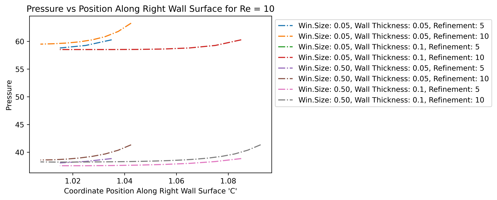{width=100% height=40%}  
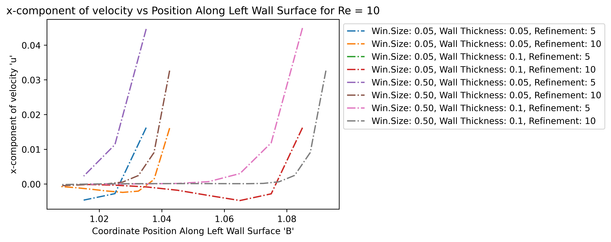{width=100% height=40%}  
{width=100% height=40%}  
{width=100% height=40%}  
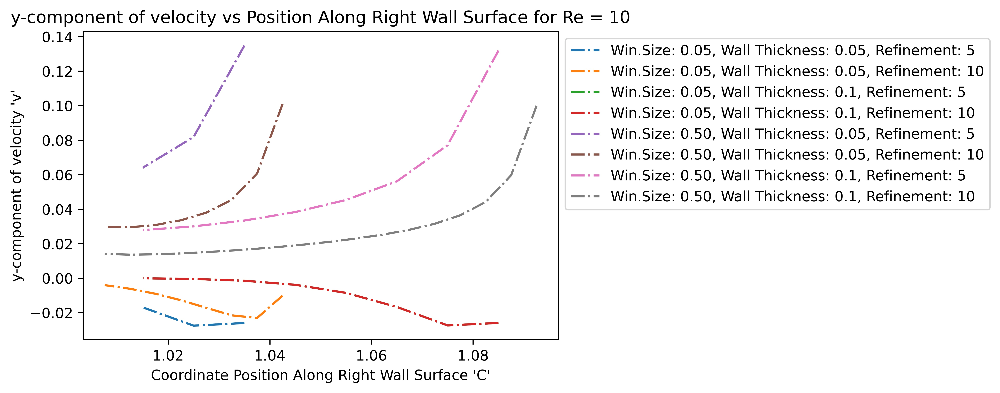{width=100% height=40%}  


### Re=200

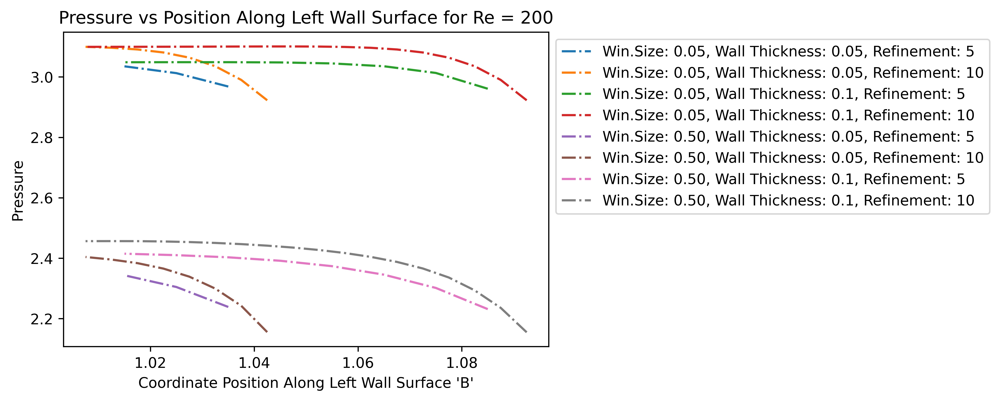{width=100% height=40%}  
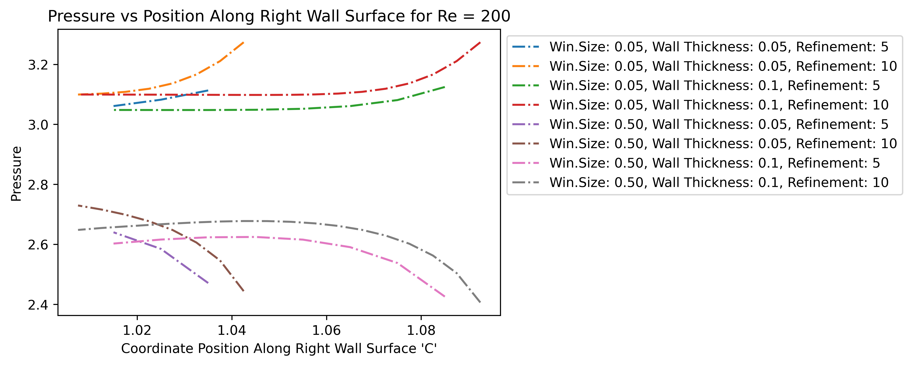{width=100% height=40%}  
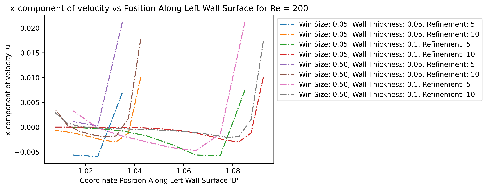{width=100% height=40%}  
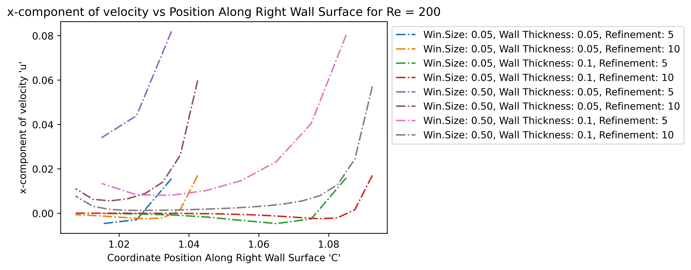{width=100% height=40%}  
{width=100% height=40%}  
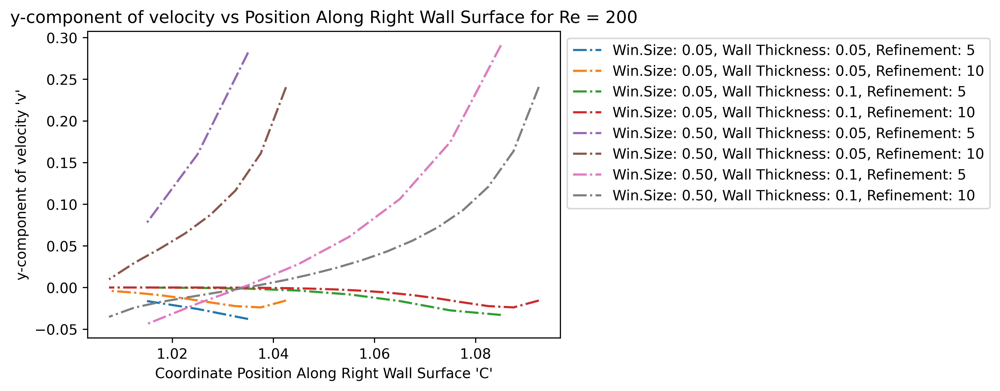{width=100% height=40%}  


## Cavity Midline Solution Profile

Now consider the profiles along the vertical midline down the cavity; from the middle of the window down to the back of the cavity.  

### Re=10

{width=100% height=40%}  
{width=100% height=40%}  
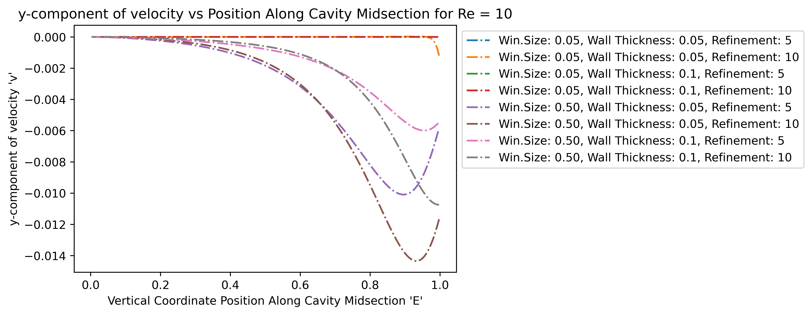{width=100% height=40%}  


### Re=200

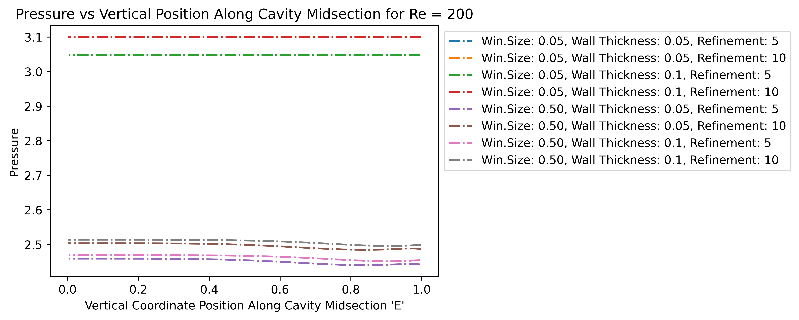{width=100% height=40%}   
{width=100% height=40%}  
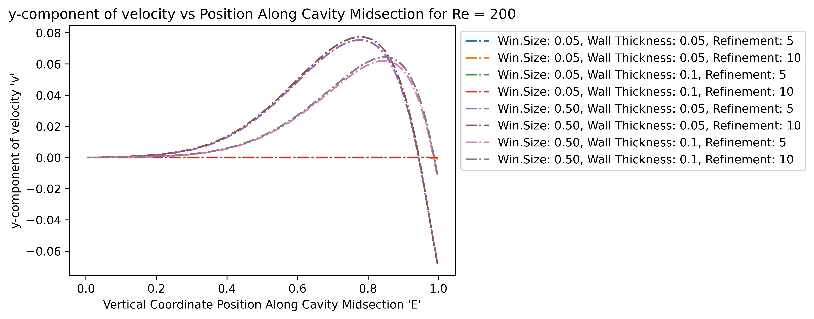{width=100% height=40%}    
