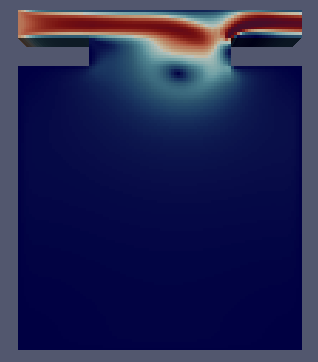
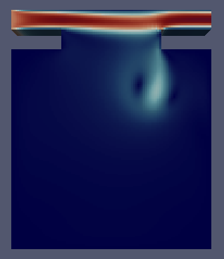
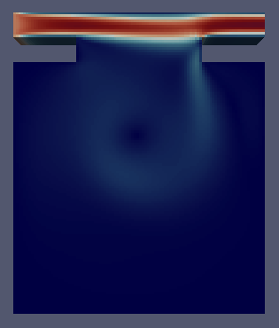
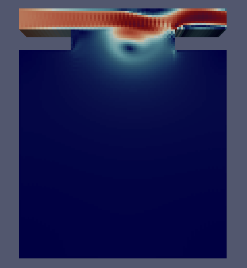
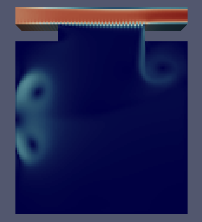
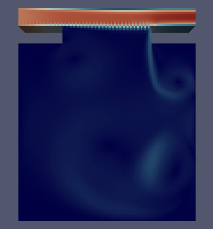

# High Reynolds Number Part 1

Although low-speed Reynolds number flow is beneficial for primary flow analysis, the flow in such a scenerio wold not prove catastrophic. Storms, be it hurricanes or tornados, contain flow of a high Reynolds number as is proportional to the velocity. In this section the flow behavior within a cavity of uniform wall thickness and window width will be analyzed with a high Reynolds number freestream flow outside of the cavity.

Note again all values are nondimensionalized - all lengths are in terms of $L$, the cavity length, all speeds in terms of $U$, the initial flow speed, and all times in terms of $\frac{L}{U}$.  

The pressure is in terms of $\frac{p}{\rho U^2}$.  

## General Solution Form 

Given the results from the Low Reynolds simulations, we will now consider only a window width of 0.5 and a wall thickness of 0.1. Images only for the refined mesh will be shown, for brevity.

Plots will be shown in the following order: P, U, UX, UY, P-contour, U-contour, UX-contour, UY-contour, Streamlines for T=60.  

### Re=1000  

{width=40% height=20%}
{width=40% height=20%}
{width=40% height=20%}
{width=40% height=20%}
{width=40% height=20%}
{width=40% height=20%}
{width=40% height=20%}
{width=40% height=20%}
{width=40% height=20%}  

There is obvious vortex shedding at the right wall; one can see a tail extending into the cavity in nearly all the plots. Otherwise, this is quite similar to the low-Reynolds flow!  
There is again a centralized vortice, an asymmetrical bend in the crossflow, and the hydraulic jump at the top of the right wall. The only difference is the tail, possibly a von Karman vortex street.
To confirm that this is an unsteady flow, we look at the flow evolution over time.

### Re=1000, U at T=1,2,6  

{width=40% height=20%}
{width=40% height=20%}
{width=40% height=20%}  

Clearly the flow is steady at large scales! So the vortex tail may not actually be a vortex street, since the unsteadiness is only at small scales. So Re=1000 is the above the lower-limit for the critical Reynolds number for large-scale flow, and below the critical Reynolds for small-scale flow. The overall critical Reynolds must then be between Re=200 and 1000.  

### Re=10000  

{width=40% height=20%}
{width=40% height=20%}
{width=40% height=20%}
{width=40% height=20%}
{width=40% height=20%}
{width=40% height=20%}
{width=40% height=20%}
{width=40% height=20%}
{width=40% height=20%}  

A much more well-defined vortex street can be seen here, and the only differences are really a more asymmetric flow with a stronger vortex street. This street can now be called such, since it does shed large-scale vortices, as seen in the following images over time. An important note: the vortex street originates from the hydraulic jump and propagates backwards, much like disturbances and sometimes turbulence can be seen behind a tidal bore or river rapids.  

### Re=10000, U at T=1,2,6,30  

{width=40% height=20%}
{width=40% height=20%}
{width=40% height=20%}
{width=40% height=20%}  

## Vortice Positions

Convergence can again easily be seen by looking at the centralized vortex position for both meshes, by differing geometry.

```{r, tidy=FALSE}
data2 <- read.table(stringsAsFactors = FALSE, header = TRUE, sep="/", text =
'meshfactor/Reynolds/window(a)/wall(w)/Vortex Center Location along Y
3/1000/0.50/01/0.691667
5/1000/050/01/0.705
3/10000/0.50/01/0.641667
5/10000/050/01/0.595'
)
knitr::kable((data2), booktabs = TRUE,
caption = '')
```

## Strouhal Number and Vortex Shedding
The strouhal number is a dimensionless value that describes the behavior of flow oscillation. A very low Strouhal number denotes very few perturbations in the flow, whereas a very high Strouhal number denotes viscous behavior - while a moderate Strouhal number indicates vortex shedding.

We will now look at the frequency of the vortex shedding that occurs at the right window wall. In non-dimensional form (in terms of L/U), this is the Strouhal number.    
Two probes are placed 0.025 to the left and right of the right vertical wall, 0.05 below the lower edge. We will denote the left probe as probe 0, and the right probe as probe 1.  
Coarse meshes will be shown along with their refinements.  

### Fast Fourier Transform (over all time)  

From the images shown earlier, clearly there is no vortex shedding for the Re=1000 case, and it seems to stabilize quickly, so one might assume that the flow is steady.  
Below we have only treated the Re=10000 case, since the Re=1000 case does not produce useful filtered output (which might seem to corroborate the above.  

#### Re=10000, Probe 0

{width=40% height=20%}
{width=40% height=20%}  
{width=40% height=20%}
{width=40% height=20%}  

#### Re=10000, Probe 1

{width=40% height=20%}
{width=40% height=20%}  
{width=40% height=20%}
{width=40% height=20%}  

Note that the meshFactor of 3 fails to capture solution behavior (see the added oscillation).  

### Short Time Fourier Transform (spectrogram to see time evolution)  


#### Re=1000, Probe 0

{width=40% height=20%}
{width=40% height=20%}  

#### Re=1000, Probe 1

{width=40% height=20%}
{width=40% height=20%}  

Interestingly, the Re=1000 plot is not at 0 Strouhal number!
So we can clearly see that the large-scale flow does not have any steady-state oscillation (which is what the previous FFT plots show), but the small-scales are unsteady, with a typical Strouhal number near 0.2, as seen in the later table.

This is confirmed by the following:

> For spheres in uniform flow in the Reynolds number range of 8×10^2 < Re < 2×10^5 there co-exist two values of the Strouhal number. The lower frequency is attributed to the large-scale instability of the wake, is independent of the Reynolds number Re and is approximately equal to 0.2. The higher-frequency Strouhal number is caused by small-scale instabilities from the separation of the shear layer.[@vort1; @vort2]  


#### Re=10000, Probe 0

{width=40% height=20%}
{width=40% height=20%}  

#### Re=10000, Probe 1

{width=40% height=20%}
{width=40% height=20%}  

Continuing the former analysis, we see that the large scale instabilites are independent (since we get another Strouhal number for Re=10000 near 0.2 later in the flow).
On the other hand, the small-scale instabilities are more prominent here, in the form of disturbances to the transform. We do not capture the other Strouhal number due to placement of the probes; we are interested in the large scale flow, so the other Strouhal number is not relavant for this paper.  

Note again that the meshFactor of 3 is insufficient to capture the solution.

#### Equilibrium Large-Scale Strouhal Values   

Note that transient Strouhal numbers exist for Re=1000, and there are also small-scale Strouhal numbers for Re=1000, but those are neither relavant nor easily retrievable for this study.   

```{r, tidy=FALSE}
data2 <- read.table(stringsAsFactors = FALSE, header = TRUE, sep="/", text =
'meshfactor/Reynolds/ProbeNumber/Strouhal
3/10000/0/0.116472
3/10000/1/0.166389
5/10000/0/0.316139
5/10000/1/0.149750'
)
knitr::kable((data2), booktabs = TRUE,
caption = '')
```

Note the stark difference between left and right frequencies - the higher one may be the second Strouhal number mentioned in the previously cited articles.


