# High Reynolds Number - Part 2  

## Window Wall Solution Profiles

Now consider again the profiles along the left and right window walls; the vertical segments along the inside of the window.  
This time we will consider the starting behavior of these profiles at high Re, in particular between T=1 and 2.  

### T = 1.3 (unsteady startup)

#### Re=1000

{width=100% height=40%}  
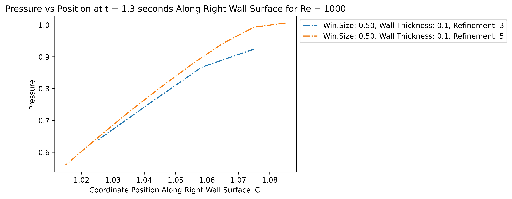{width=100% height=40%}  

The pressure curves match the general images earlier; the only feature of note is the dip near 1.1, which is low pressure caused by rapidly accelerating corner flow.  
The other dip at the cavity interior (near 1) is also due to the corner point; the lower velocity in the cavity compared to the crossflow causes the lower prominence of this dip.  
By contrast, the right wall has a vortex just leaving the wall, so the sample is basically from the vortex center to edge, and we can see that the low-pressure zone caused by vortice is 0.5 $\rho U^2$ lower than standard pressure.  

##### Left Velocity

{width=100% height=40%}   
{width=100% height=40%} 

Important to note here is the stagnation point near the lower corner (at y=1.3). Both the X and Y velocities are 0 here. The flow above this point gets sucked back into the crossflow (as seen by the positive y-velocity and negative x-velocity) in a sort of recirculation, and the flow below this point remains in the cavity, moving up and right to join the part of the crossflow that enters the cavity.  

##### Right Velocity
  
{width=100% height=40%}
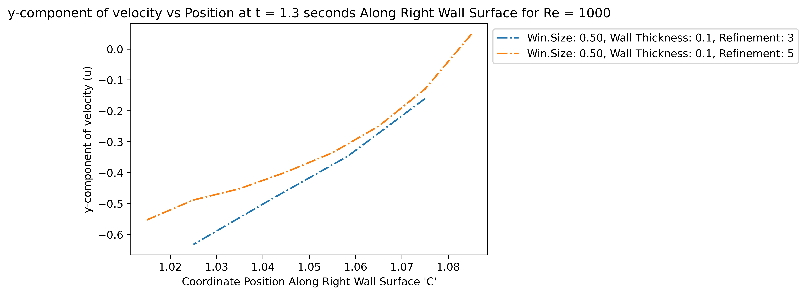{width=100% height=40%}  

On the right wall, since we are sampling the edge of a vortice, the x-component is similar to 1/4 of a sinusoid (and this can be verified by noting from the earlier images that the vortice described here has a radius of approximatedly 0.1 (the wall width). The y-velocity is similarly sinusoidal, but has a strong negative velocity. Since we are almost sampling along the vortical radius, the velocity of the vortice wall should be roughly 0.6 $U$ (free-stream velocity), and the vortex center (or eye) is moving downward at 0.6 $U$.  

#### Re=10000

Since from previous results, we have invalidated the refinement / meshFactor 3 for Re=10000 as being insufficient, that will not be considered for convergence in the following plots.  

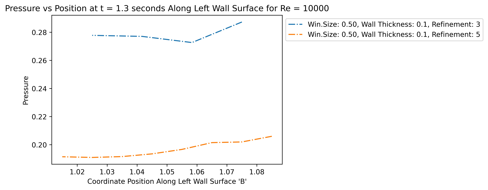{width=100% height=40%}  
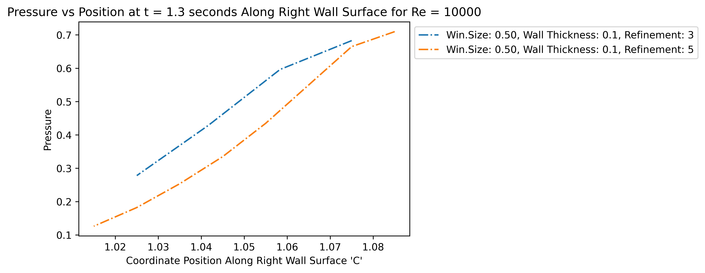{width=100% height=40%}  

Just as before, the left wall has little to no pressure variation. Changing to Re=10000 has replaced the upper-left corner flow with a high-pressure region, possibly a stagnation point, implying that any inflow now travels further past the corner before moving into the cavity.
Again, the right wall approximates the pressure differential across the main vortice, which seems to be about 0.65 $\rho U^2$. Note the sharp corner in the fine-refinement pressure; that is probably the vortice edge.  

##### Left Velocity

{width=100% height=40%}  
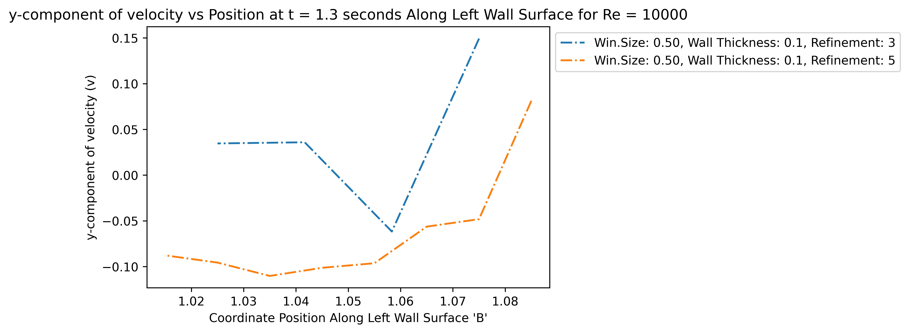{width=100% height=40%}  

There is a really strong upward velocity with a negative x-component at the top-left corner, implying recirculation formation, which would correspond to the first transition vortice seen in low-Reynold flow. For the rest of the left wall, there is a small downward flow, possibly corresponding to the second transition vortice in low-Reynolds flow, again.  

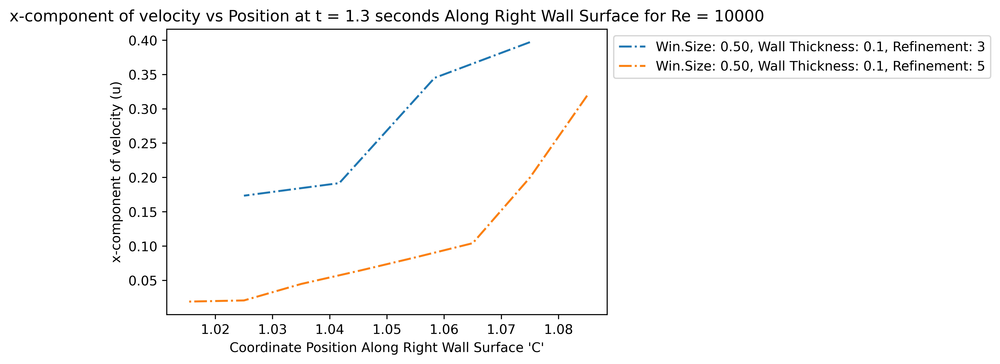{width=100% height=40%} 
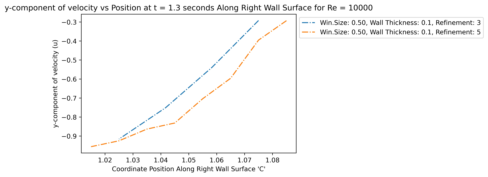{width=100% height=40%}  

Again, from the images, this wall samples the main vortice. Looking at the X-velocity, and Y-velocity (stopping at the change in concavity), we see a difference in of about 0.3 and 0.6 $\rho U^2$. So combining the speeds, the vortice speed (which will again be equal to rotation speed at edge) would approximately be about 0.67 $\rho U^2$ (using L2 magnitude). Notice that this matches with the pressure in these non-dimensional units (since U=1), just like Re=1000, which is as expected.  

Interestingly, most of the flow-field, with the exception of the vortex shedding, is identical to the low-Reynolds, which might imply that portion of the flow causes the Strouhal number of 0.2.

## Cavity Midline Solution Profile

Now again consider the profiles along the vertical midline down the cavity; from the middle of the window down to the back of the cavity.  
Similarly, we will only consider T=1.3.

#### Re=1000
  
{width=100% height=40%}  
{width=100% height=40%}   
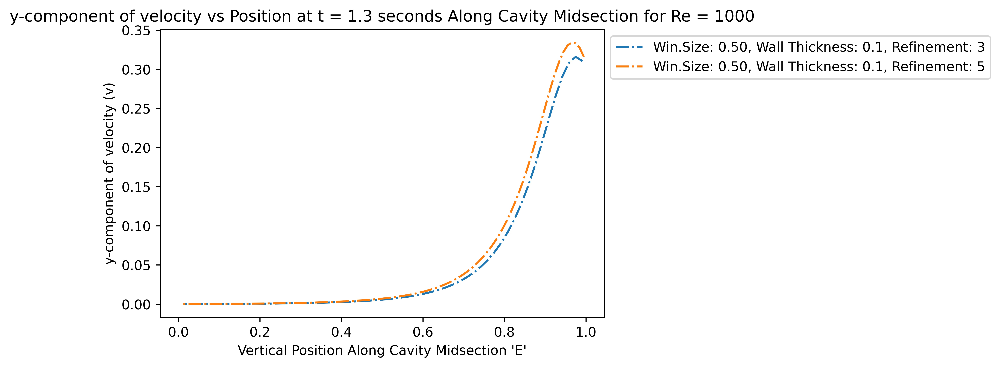{width=100% height=40%}  

#### Re=10000

{width=100% height=40%}  
{width=100% height=40%}  
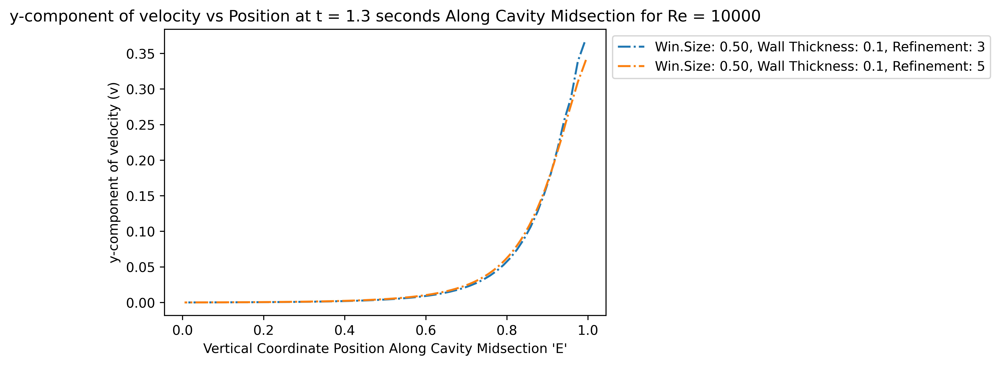{width=100% height=40%}  

### Mean Strain Rate over Time

To confirm that the maximum strain rate does occur at T=1.3, we plot the mean strain rate over time, for the left and right vertical window walls.  

#### Re=1000

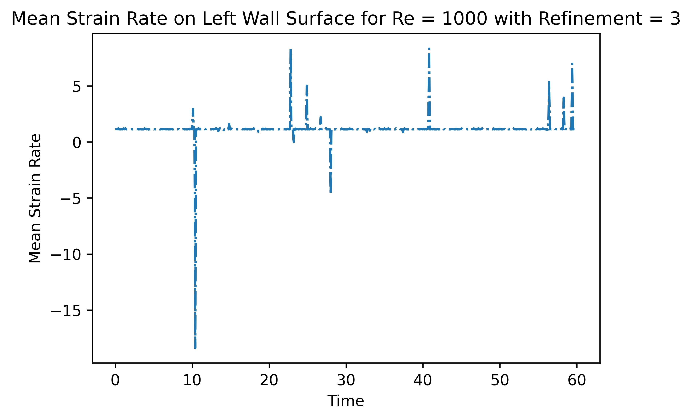{width=40% height=20%}
{width=40% height=20%}
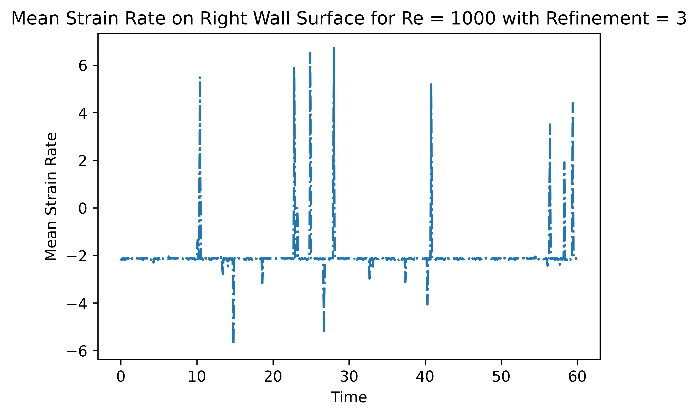{width=40% height=20%}
{width=40% height=20%}  

#### Re=10000  

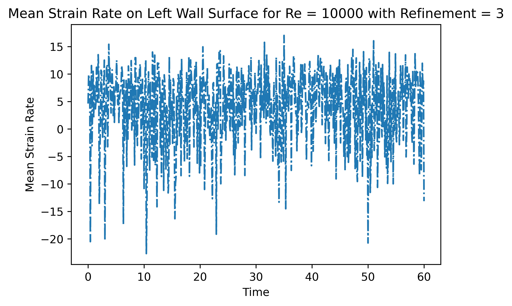{width=40% height=20%}
{width=40% height=20%}
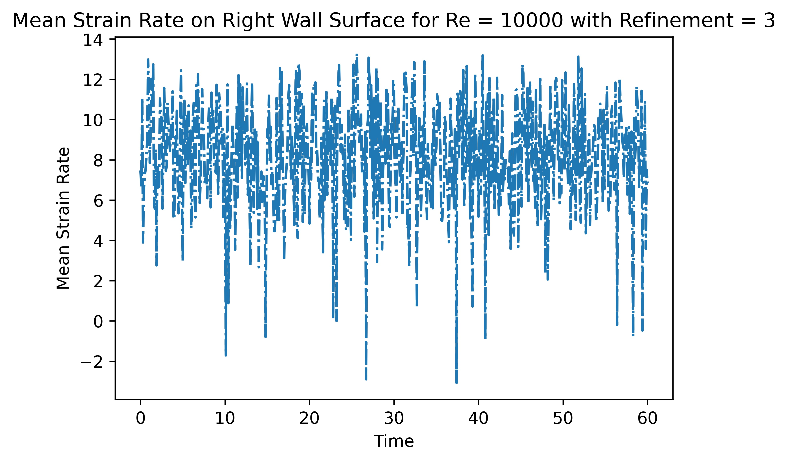{width=40% height=20%}
{width=40% height=20%}  

Unfortunately, these results do not match T=1.3 as maximum. Noting that the refinement or meshFactor 3 still fails for Re=10000 in a manner similar to the previous plots, we can probably rule out code errors.
The possible other issues might be a lack of sufficient refinement, since there does not seem to be uniform convergence - the spikes near T=60 are similar, but other regions have sign changes between refinements. Also, there could be precision errors, as OpenFoam has only been set to output 6 significant figures. Finally, the FDE (finite difference equation) used to calculate the strain rate may be inaccurate, since we used a first-order forward/backward difference for the left and right walls. This was done since only two OpenFoam samples were taken at each wall per timestep, but that may not have been sufficient.

Assuming that the above is accurate, the net force on the internal beams comprising those walls can be calculated as follows (in units of $\rho U^2 L^2$):  
$$F = w*\tau = (0.1)*\tau = (0.1)*\mu*(stress\_rate)$$

Since these results are fairly questionable, we do not calculate an example.  

## Volumetric Flow Rate and Mixing

To investigate inflow/outflow rates, we will consider integration of a profile across the internal window opening (profile D on the mesh diagram).  
Note that the meshFactor of 3 fails for Re=10000 again.  

{width=40% height=20%}
{width=40% height=20%}
{width=40% height=20%}
{width=40% height=20%}  

Looking at the net flow rate, clearly the cavity first pressurizes and then slowly depressurizes over time.   
While this is happening, large amounts of fluid are still being cycled through the window - a huge amount in the first few timesteps (up to ~T=2),
and then a somewhat large amount afterwards.  

To visualize the scale, an example will be shown.

For a $1m^2$ window and $90km/hr (56mph)$ wind, approximately $(25m/s)(1)(1)(0.08) = 2m^3 per second$ is cycled through in the first ~2 seconds!  
Afterward, $0.25m^3/s$ is cycled in and out on average.  
After the initial spike, there is a net decreasing outflow starting at $0.05m^3/s$ (using the Re=10000 plot).  
Note this example is fairly realistic, since an EF0 tornado has slightly higher windspeed, and can be approximated as parallel streamline flow due to the large tornado radius.  
While this example is not entirely accurate since the windspeed used can produce much higher Reynolds numbers in flow, the large-scale behavior is identical, as shown below.

Note that the maximum cycle flow rate of 8% freestream is consistent between both Reynolds numbers. From the previous analysis on Strouhal numbers, we see that since the large-scale flows are fairly Reynolds-number-independent, it is possible that the volumetric flowrate has converged, and will remain the same for higher Reynolds numbers.  

If that is the case, then the low-Reynolds analysis can be combined with a couple of measurements of high-Reynolds flow, and extrapolated out to actual cases, providing an extremely useful tool for flow estimation.  

A possible topic for further investigation would be the generation of fixed-Strouhal-number flow components with different Reynolds numbers. If the flow field can be seperated into higher frequency harmonics that are added with higher Reynolds number, then that would allow modeling of higher Reynolds flow primarily with low-Reynolds measurements.   

